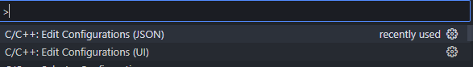
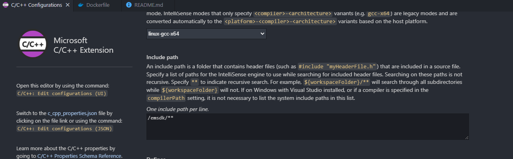

# Docker 컨테이너 생성
```bash
docker build -t c-wasm-env .
docker run -b c-wasm-env
```

# 컨테이너 접속후
UI로 들가서 emsdk 가설치된 경로 기입

<br/>
예시


# 컴파일 방법
```bash
emcc hello.c -o hello.html
```

# 실행해보기
```bash
python3 -m http.server 9000
```

# 참고자료
```bash
https://velog.io/@mahwin/WASM-%EC%82%AC%EC%9A%A9%ED%95%98%EA%B8%B0
```
